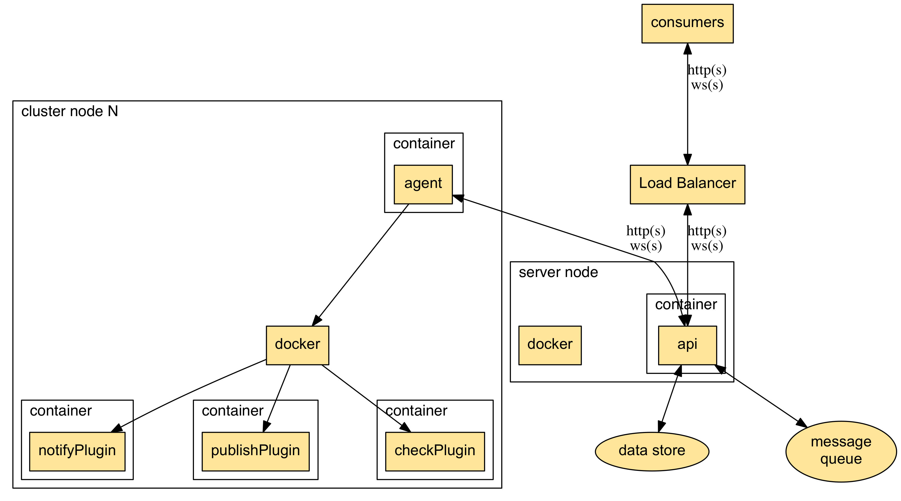

# Sauron Cluster Architecture

This doc describes the architecture of a Sauron cluster.

Cluster Provides:
* Api endpoint for all services
* Message queing for jobs
* Data store for holding [resources](./resources.md) and associated runtime/historical
data.

Design Decisions
----------------

* Docker chosen to package agent/server components for portability
* API server is stateless to promote simplicitly and HA deployments
* Agents speak to unified Server API to decouple data stores
* All plugin types implemented as Docker contianer images for modularity/extensibility

Modes
-----

The Cluster can be ran in two modes described below.

* **small**

  * Default mode with a base install. Server contains the api service as well as data store and message queue.
> This architecture is not recommended for production use
* **ha**

  * load balancer fronts N instances of api service (must support websockets)
  * data store is external from server, following HA best practice for supported data store
  * message queue is external from server, following HA best practices for supported message queue provider

